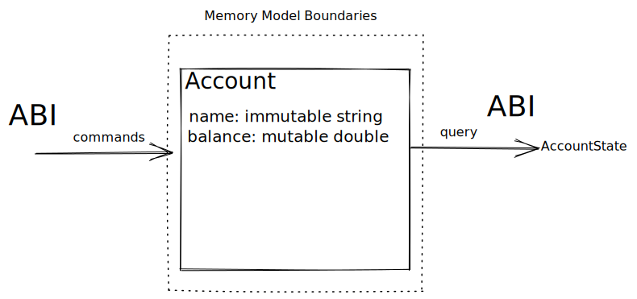

# Memory Layout Isolation

Sonata has two encapsulation boundaries at the language level. Value classes 
and entity classes. They serve two completely different use cases, and thus,
can have different ABIs.

One of the main concerns of current ABIs is that memory is public available to the module
and can be accessed freely. For example, in most ABIs, structs need to have a specific layout so public
modules can read and mutate the public state of the struct.

Also, ABIs are different depending on the hardware and operating system, adding complexity and
making optimizations more complicated for the compiler.

The Sonata compiler exposes an ABI, as any compiler, but internally it follows an internal modeling mechanism
that is used to optimize memory access patterns specific to Sonata.

Sonata is based on entities that are enforced encapsulation units:

* Entity state is private to the instance of the entity
* Entities are single-threaded
* Entities are mutable only within the entity context

So, for example, consider the following code:

```sn
value class AccountBalance(account: string, balance: double)

entity class Account(name: string, balance: double) {
    let deposit(amount: double) = self.balance += amount
    let withdraw(amount: double) = self.balance -= amount
    let withdraw(amount > self.balance) = nothing
    
    let balance() = AccountBalance(self.name, self.balance)
} 
```

Thanks to Sonata encapsulation boundaries, we can do the following assumptions:

* name is effectively immutable
* balance is only going to be modified by a single thread
* State is shared only by a single public mechanism: public method balance

So with mutation and query rules being clear, we can optimise these access patterns and separate the ABI
from the internal memory model.

